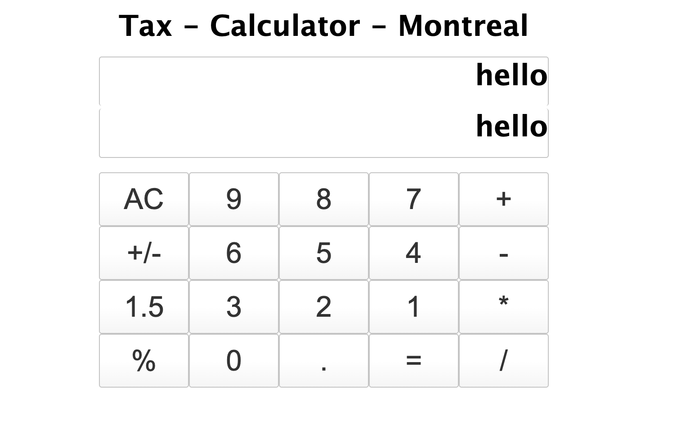

### Tax - Calculator - Montreal

### Task

1. When the user clicks the number button, the display field shows the value of the button.
2. When the user clicks the AC button, the display field is cleared.

### Problems

1. When the user clicks the < button, it is able to remove last number or operator
   > - using clear state, only remove the previous number, no working in current number
